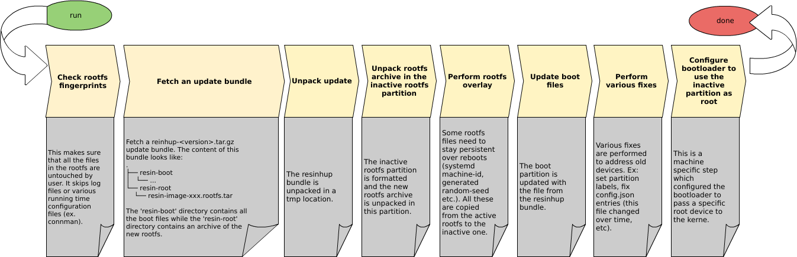

# balenaHUP
Tool for balena host OS updates. It downloads an update bundle that replaces the balenaOS for a balena device, updating both the boot partition and the rootfs (using an inactive rootfs partition).


## Upgrade balenaOS with openBalena-Devices

This version allows you to upgrade official balena-devices and also devices which are connected to an third-party openBalena-api-endpoint.
It combines the public api and your custom 
The official balena-API uses an SSH Proxy.
To use the updgrade scripts for your openBalen environment you have to set up the ssh connection with an proxytunnel.
With some modifications in following files it is possible to upgrade balena and openBalena devices.

+ upgrade-ssh-2.x.sh
+ upgrade-2.x.sh

For upgradeing an openBalena device we need also this file:
+ update-balena-supervisor.sh

`update-balena-supervisor.sh` is stored in the balenaOS image (/usr/bin/update-balena-supervisor) but at current developement state it is impossible to upgrade the supervisor with it.
So the upgrade script upload the modified version and uses this custom-version during the upgrade process. 


To upgrade your openBalena devices only this command line is neccessary to run:

````
./upgrade-ssh-2.x.sh  --uuid <uid_device_1>  --uid <uid_device_2>  --hostos-version 3.0.5  --no-delta  --open-balena
````

### New start parameters for upgrade-ssh-2.x.sh script

1. --open-balena

   * use own proxytunnel for ssh-connection
   * copy modified update-balena-supervisor.sh to device's /tmp folder
   * use public balena api to get informaions about the registry path of the given hostos-version
   * use private device open balena api to set get device specific informations
   * start modified update-balena-supervisor.sh after upgrading os-system
   * use public balena api to get informaions about the correct supervisor version and registry path of the needed supervisor version

2. --no-delta

    do not search for delta updates, only install complete image

3. --verbose

    do not log into log files, print everything to your unix-device to be able to debug the upgrade process.

## Helpfull informations

After building/compiling the complete OS from the source code, the build-system will generate an docker-image, which includes the "upgrade-image" of the operation system for the specific device-type.

**Beware**:
The naming is quite confusing because, docker use the word image for docker - registry entries and for example for an raspberry pi a image is the operation system file to flash the device.

So this image-file will be uploaded into the public openBalena docker-registry.(`registry2.balena-cloud.com`)
The information which is available for specific device-types is stored in the public balenaAPI (`https://api.balena-cloud.com/v6/release`, complete commando below)


Running start the `upgrade-ssh-2.x.sh` script with the needed hostOs Version will check if the device is online.
If it is only, the script will start the upgrade-2.x.sh script with ssh remote on the device.
This script is running directly on the specific device.

It will make some prerequisites checks and will parse the docker-registry-image-path to the specific hostOS version of the specific devices hardware type (like raspberrypi4-64)

After it have all information it will start the script hostapp-update what comes with the operating system. (/usr/bin/hostapp-update)

This script will download the docker-imager from the given docker registry link and will extract the new raspberry pi "image" to the second partition.

After this magic is done, the `upgrade-2.x.sh` will search for the correct supervisor version in the public balena api.
The new supervisor is also stored in a docker-image available in the public docker-registry.


**Beware**:
The supervisor upgrade script `/usr/bin/update-balena-supervisor` is not able to work with open balena. Due this reason the scp command will copy a customized version to the /tmp folder of the device.

This script will download the new supervisor version from the docker-registry and extract all files.
After the upgrade is done the system will reboot


## Prerequisites

+ You have to be able to connect to your devices with an simple ssh command.

    For example `ssh <your_uid>.balena`

    to archive these you have to set up and proxy tunnel server

    Use this git-repo to build your ssh-proxy-server:
    https://github.com/balena-io/balena-cli/blob/96774f4c52b155b7761e6ee70ba505149b318d3c/lib/utils/tunnel.ts#L24

    and these settings on your ubuntu/unix environment

    ````
        we need 3 configuration files
        ~/.ssh/balena.proxytunnel (Proxytunnel-Credentials for your proxy tunnel https://tunnel.<company-url>)
        ~/.ssh/config.balena-proxy (openssh-parameter to log into sshd of your BalenaOS-Devices)
        ~/.ssh/config.balena-names (name list of your devices)

        install the application proxytunnel on your system
        sudo apt install proxytunnel

        set -u # print error, if $BALENA_API_KEY is not set (access-token for openbalena):
        echo -e "proxy_user = admin\nproxy_passwd = $BALENA_API_KEY" >~/.ssh/balena.proxytunnel
        chmod 600 ~/.ssh/balena.proxytunnel # proxytunnel will check that.
        cat >"$HOME/.ssh/config.balena-proxy" <<EOH
        Host *.balena
          User root
          Port 22222
          RequestTTY yes
          ProxyCommand proxytunnel -E -p tunnel.<company-url>:443 -d %h:%p -F $HOME/.ssh/balena.proxytunnel
        EOH

        # needed if you want to connect via the name of the device to the device
        balena devices --json|jq -r \
        '.[] | "Host \(.device_name).balena \(.fleet|sub("admin/";"")).balena\n\tHostname \(.uuid).balena\n"' \
        >~/.ssh/config.balena-names


        nano ~/.ssh/config
        add at the end of all lines
        Include config.balena-names
        Include config.balena-proxy


        #if everything is configured correctly then you will be able to use ssh, scp and rsync with your openBalena devices
        ssh <your_uid>.balena
    ````


+ Otherwise change this file and implement your own ssh-proxy command

## Helper commands

* list all available host-os for specific device type:

    this huge command will list all available hostos - versions:
    ````
    device=raspberrypi4-64 && curl "https://api.balena-cloud.com/v6/release?\$select=id,semver&\$expand=contains__image/image&\$filter=(belongs_to__application/any(a:a/is_for__device_type/any(dt:dt/slug%20eq%20%27${device}%27)%20and%20is_host%20eq%20true))%20and%20is_final%20eq%20true%20and%20is_invalidated%20eq%20false%20and%20semver%20ne%20%270.0.0%27%20and%20(release_tag/any(rt:(rt/tag_key%20eq%20%27version%27)))%20and%20((release_tag/any(rt:(rt/tag_key%20eq%20%27variant%27)%20and%20(rt/value%20eq%20%27production%27)))%20or%20not(release_tag/any(rt:rt/tag_key%20eq%20%27variant%27)))"| jq -r ".d[].semver"
    ````

## To Do

Update the update-balena-supervisor in the meta-balenaos repository.
`https://github.com/balena-os/meta-balena/blob/master/meta-balena-common/recipes-containers/balena-supervisor/balena-supervisor/update-balena-supervisor`

## Start upgrading your open balena deevice


## Warning of deprecated informations

All following information seems to be outdated.
For all new devices only to files of the complete git-repo are neeeded.

+ upgrade-ssh-2.x.sh
+ upgrade-2.x.sh

For upgradeing an openBalena device we need also this file:
+ update-balena-supervisor.sh

All other files, scripts, dockerfiles and folders are not needed anymore!

`update-balena-supervisor.sh` is stored in the balenaOS image (/usr/bin/update-balena-supervisor) but at current developement state it is impossible to upgrade the supervisor with it.


Be aware that in the current stage of development **this tool is not meant to be ran by itself but through a** [wrapper](https://github.com/balena-os/meta-balena/blob/master/meta-balena-common/recipes-support/balenahup/balenahup/run-resinhup.sh) developed in [meta-balena](https://github.com/balena-os/meta-balena). This wrapper takes care of all the prerequisites needed for this tool and adds support for balena Supervisor updates as well. In this way, using that wrapper, a device can be updated completely (balenaOS + Supervisor).

The current development stage uses **docker images/containers to deploy and run** this tool. This is because when we first developed this tool the balenaOS was not providing all the python prerequisites needed for it to successfully work. The long term plan would be to bring it completely in the balenaOS including all the prerequisites. This is not completely decided because balenaOS has hard requirements on rootfs size and we try to keep it as small as possible. So this docker container solution is kept for now even though it adds the overhead of downloading an image before being able to run the updater.

## Docker containers versus git repository
The releases for balenaHUP are marked in this git repository as git tags. As well the git repository includes Dockerfiles for each balenaHUP supported resin board. For example there is a Dockerfile called _Dockerfile.raspberrypi3_ which is the Dockerfile for creating a balenaHUP docker image for [Raspberry Pi 3](https://www.raspberrypi.org/blog/raspberry-pi-3-on-sale/) boards. We currently upload our balenaHUP docker images to resin registry (registry.resinstaging.io). We do this because old resin devices were using docker 1.4 which can't pull from registry v2 dockerhub.

For each balenaHUP release (tag) there will be a set of docker images with the same tag uploaded to the above mentioned registry. The images have the name format: `balenaHUP-<board-slug>`. The full docker images URL format becomes `registry.resinstaging.io/balenaHUP/balenaHUP-<board slug>` .

Example. For release 1.0 (git tag 1.0), balenaHUP supports the following device slugs: beaglebone-black, intel-nuc, raspberry-pi, raspberry-pi2 and raspberrypi3. For each slug there is a corresponding Dockerfile: Dockerfile.beaglebone-black, Dockerfile.intel-nuc, Dockerfile.raspberry-pi, Dockerfile.raspberry-pi2 and Dockerfile.raspberrypi3. For each Dockerfile there are docker image pushed to the registry:

```
registry.resinstaging.io/resinhup/resinhup-raspberrypi3       1.0  c324b00459f3        2 days ago          241.4 MB
registry.resinstaging.io/resinhup/resinhup-raspberry-pi2      1.0  4ca1d77c1457        2 days ago          174.3 MB
registry.resinstaging.io/resinhup/resinhup-raspberry-pi       1.0  4ca1d77c1457        2 days ago          174.3 MB
registry.resinstaging.io/resinhup/resinhup-intel-nuc          1.0  63cc85875b84        2 days ago          225.3 MB
registry.resinstaging.io/resinhup/resinhup-beaglebone-black   1.0  7553637ea826        2 days ago          258.3 MB
```

The images taged as _latest_ are following the HEAD of master branch.

Hint: there is a script helper called [docker-build-and-push.sh](https://github.com/balena-os/balenaHUP/blob/master/scripts/docker-build-and-push.sh) for pushing images to registry. Check its help.

## How to use
Use run-resinhup.sh [wrapper](https://github.com/balena-os/meta-balena/blob/master/meta-balena-common/recipes-support/balenaHUP/balenaHUP/run-resinhup.sh) developed in [meta-balena](https://github.com/balena-os/meta-balena). Check _run-resinhup.sh_ help message for all the configuration you can use. Make sure the _run-resinhup.sh_ along with _update-resin-supervisor_ and _resin-device-progress_ scripts are updated.

Pro Hint: In order to make sure these scripts are updated and able to run balenaHUP on multiple devices (batch/fleet updates), **admins** can use a wrapper on top of _run-resinhup.sh_ called [run-resinhup-ssh.sh](https://github.com/balena-os/meta-balena/blob/master/scripts/balenaHUP/run-resinhup-ssh.sh). This wrapper is not intended for public use as it requires SSH access to the devices over VPN along with admin permissions for API queries. Check _run-resinhup-ssh.sh_ help message for all the configurations you can use.

## BalenaHUP architecture for 1.x->1.x updates
Currently there are 3 components involved in updating a device:
+ balenaHUP (docker images)
+ run-resinhup.sh (bash wrapper)
+ run-resinhup-ssh.sh (bash wrapper)

### balenaHUP

This component is distributed from this repository as docker images (explained above). The overall workflow of the tool is:


### run-resinhup.sh

This is a wrapper which pulls the proper balenaHUP image and runs the updater:

+ takes care of all the prerequisites
+ adds support for supervisor update
+ pulls balenaHUP image
+ runs balenaHUP container
+ if updater is successful, reboots the board

This script is found in [balena-os/meta-balena, 1.x branch](https://github.com/balena-os/meta-balena/tree/1.X)/.

### run-resinhup-ssh.sh

This is a tool which:

+ Uploads over ssh all the needed tools from meta-balena (update-resin-supervisor, run-resinhup.sh and resin-device-progress).
+ Runs run-resinhup.sh over a set of devices and saves the log in a file called `<uuid>.resinhup.log`
+ Can run the updater over multiple devices in parallel.

It requires SSH access over VPN to devices.

This script is found in [balena-os/meta-balena, 1.x branch](https://github.com/balena-os/meta-balena/tree/1.X)/.

## balenaHUP architecture for 1.x->2.x and 2.x->2.x updates

Currently there are 2 components involved in updating a device for these versions

+ `upgrade-<...>.sh` (bash wrapper)
+ `upgrade-ssh-<...>.sh` (bash wrapper)

## upgrade-<...>.sh

The `upgrade-1.x-to-2.x.sh` and `upgrade-2.x.sh` are wrappers that which pulls the proper host OS image and runs the updater:

+ takes care of all the prerequisites
+ adds support for supervisor update
+ if updater is successful, reboots the board (default, but adjustable over command line parameters)

Run them with the `--help` flag to see all the options

### upgrade-ssh-<...>.sh

The `upgrade-ssh-1.x-to-2.x.sh` and `upgrade-ssh-2.x.sh` scripts are wrappers which:

+ Runs run-resinhup.sh over a set of devices.
+ Can run the updater over multiple devices in parallel.

It requires SSH access over VPN to devices, which is enabled for general users for balenaOS version 2.7.5 and above.

Set up your device connection settings in your SSH `config` by adding a record like this:

```
Host resindevice
  User <username>
  Hostname ssh.resindevice.io
  LogLevel ERROR
  StrictHostKeyChecking no
  UserKnownHostsFile /dev/null
  ControlMaster no
  IdentityFile <path-to-identity-file>
```

The `User` and `IdentityFile` sections are optional, and depend on your SSH setup. The name `resindevice` is arbitrary, and you can use any other value (unique within the `config`). That will be the name that you need to use with the `-s` command line flag.

For for [staging](https://dashboard.resinstaging.io) use `Hostname ssh.devices.resinstaging.io`.


## Development
Want to contribute? Great! Throw pull requests at us.

## TODOs
 - Safety checks for "to be updated" partition (size, existent fs etc.)
 - Use the boot file from a directory in the rootfs update partition called "/assets"
 - Add support for other resin supported targets

## Version
See balenahupmeta.py.

## License
See balenahupmeta.py.
